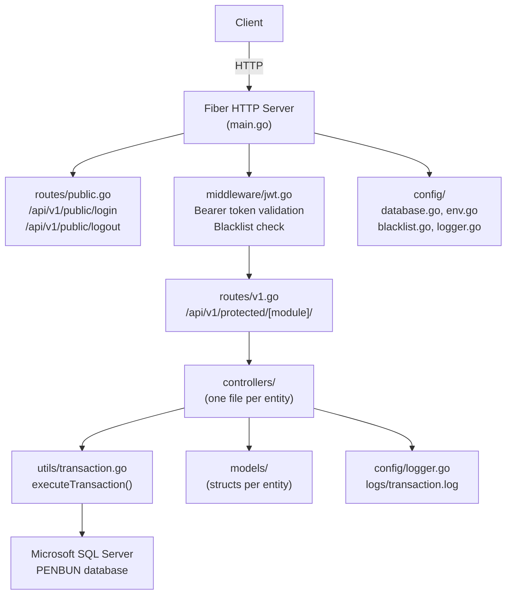

# Design Document — PenbunAPI v3.2.0

## Overview

PenbunAPI v3.2.0 is a Go/Fiber RESTful backend for a book and stationery distribution company (Penbun). It follows a **Thin API** pattern: all business-key generation and `update_date` timestamping are handled by SQL Server triggers, keeping controller code small and uniform. The API's responsibility is routing, request validation, transactional execution, and returning consistent JSON.

Every entity module exposes exactly **8 standard endpoints** (Select All, Select Page, Select By ID, Select By Name, Insert, Update, Soft Delete, Hard Delete). All mutating operations are wrapped in `executeTransaction()`. All responses use `models.ApiResponse`. Protected routes live under `/api/v1/protected/[module]/` and require a valid JWT bearer token.

### Key Design Goals

- **Uniformity**: Every module is generated from the same template — same 8 endpoints, same response shape, same error codes.
- **Safety**: Every mutation runs inside a transaction with automatic rollback on error.
- **Thin controller**: No business logic in Go code beyond field validation and FK existence checks. DB triggers own ID generation and timestamps.
- **Partial update**: All UPDATE endpoints use `COALESCE`-based SQL so clients can patch only the fields they send.
- **Auditability**: Every mutation is logged to `logs/transaction.log` with timestamp, step count, duration, and outcome.

---

## Architecture



### Request Lifecycle

```
Client Request
  → Fiber Router (routes/public.go or routes/v1.go)
  → [JWT Middleware — protected routes only]
      → Check Authorization header
      → Validate token signature + expiry
      → Check in-memory blacklist
  → Controller handler
      → Parse & validate request body / params
      → [FK existence check if required]
      → executeTransaction(db, []SqlStep{...}, logger)
          → BEGIN TRANSACTION
          → Execute each step
          → COMMIT on success / ROLLBACK on any error
          → Write to transaction.log
      → Return models.ApiResponse JSON
```

### Technology Stack

| Concern | Choice | Rationale |
|---|---|---|
| Web framework | [Fiber v2](https://gofiber.io/) | Fastest Go HTTP framework, Express-like API |
| DB driver | [go-mssqldb](https://github.com/denisenkom/go-mssqldb) | Official MSSQL driver for Go |
| JWT | [golang-jwt/jwt v5](https://github.com/golang-jwt/jwt) | Maintained JWT library, HS256 signing |
| Password hashing | `golang.org/x/crypto/bcrypt` | Industry-standard adaptive hashing |
| Env config | [godotenv](https://github.com/joho/godotenv) | `.env` file loading |
| Logging | stdlib `log` + `os` | Lightweight, no external dependencies |

---

## Components and Interfaces

### Project Directory Structure

```
PenbunAPI/
├── main.go                         # App entry point
├── .env                            # Environment variables
├── go.mod / go.sum
│
├── config/
│   ├── database.go                 # DB connection (go-mssqldb)
│   ├── blacklist.go                # In-memory JWT blacklist
│   ├── env.go                      # Env var loader + validation
│   └── logger.go                   # Transaction logger setup
│
├── middleware/
│   ├── jwt.go                      # JWT validation + blacklist check
│   └── error.go                    # Global error handler
│
├── controllers/
│   ├── auth.go                     # Login / Logout
│   ├── company.go                  # tb_company
│   ├── customer.go                 # tb_customer
│   ├── customerType.go             # tb_customer_type
│   ├── discount.go                 # tb_discount
│   ├── discountType.go             # tb_discount_type
│   ├── product.go                  # tb_product
│   ├── productCategory.go          # tb_product_category
│   ├── productGroup.go             # tb_product_group
│   ├── productFormatType.go        # tb_product_format_type
│   ├── productSku.go               # tb_product_sku
│   ├── unitType.go                 # tb_unit_type
│   ├── vendor.go                   # tb_vendor
│   ├── vendorType.go               # tb_vendor_type
│   ├── warehouse.go                # tb_warehouse
│   ├── reference.go                # tb_reference
│   └── user.go                     # tb_users
│
├── models/
│   ├── apiResponse.go              # Shared ApiResponse struct
│   ├── company.go
│   ├── customer.go
│   ├── customerType.go
│   ├── discount.go
│   ├── discountType.go
│   ├── product.go
│   ├── productCategory.go
│   ├── productGroup.go
│   ├── productFormatType.go
│   ├── productSku.go
│   ├── unitType.go
│   ├── vendor.go
│   ├── vendorType.go
│   ├── warehouse.go
│   ├── reference.go
│   └── user.go
│
├── routes/
│   ├── public.go                   # /api/v1/public/* (no auth)
│   ├── v1.go                       # /api/v1/protected/* (JWT group)
│   └── v2.go                       # /api/v2/* (placeholder)
│
├── utils/
│   └── transaction.go              # executeTransaction() wrapper
│
└── logs/
    └── transaction.log             # Append-only mutation audit log
```

### `main.go` Responsibilities

```go
func main() {
    // 1. Load .env via godotenv
    // 2. Validate required env vars (exit non-zero if missing)
    // 3. Connect to SQL Server (config.ConnectDB)
    // 4. Init logger (config.InitLogger)
    // 5. Create Fiber app with config (ServerHeader, AppName, CaseSensitive,
    //    StrictRouting, ErrorHandler, BodyLimit, timeouts, etc.)
    // 6. Register public routes (routes.SetupPublicRoutes)
    // 7. Register protected routes with JWT middleware (routes.SetupV1Routes)
    // 8. Register v2 placeholder routes (routes.SetupV2Routes)
    // 9. Print registered routes
    // 10. Listen on PORT with graceful shutdown (os.Signal / SIGTERM)
}
```

### `config/` Package

**`database.go`**
```go
var DB *sql.DB

func ConnectDB() {
    connStr := fmt.Sprintf("sqlserver://%s:%s@%s:%s?database=%s",
        user, pass, host, port, dbName)
    DB, err = sql.Open("sqlserver", connStr)
    // ping to verify
}
```

**`blacklist.go`**
```go
var (
    blacklist   = make(map[string]bool)
    blacklistMu sync.RWMutex
)

func AddToBlacklist(token string)
func IsBlacklisted(token string) bool
```
In-memory map protected by `sync.RWMutex`. Tokens are stored as full JWT strings. This resets on server restart, which is acceptable because JWTs expire independently.

**`env.go`**
```go
var requiredEnvVars = []string{
    "DB_HOST", "DB_PORT", "DB_USER", "DB_PASSWORD",
    "DB_NAME", "JWT_SECRET", "LOG_FILE", "PORT",
}

func ValidateEnv() error  // returns error if any required var is missing
```

**`logger.go`**
```go
var TransactionLogger *log.Logger

func InitLogger() error  // opens/creates LOG_FILE, creates dirs if needed
```

### `utils/transaction.go`

```go
type SqlStep struct {
    Query  string
    Args   []interface{}
}

func executeTransaction(db *sql.DB, steps []SqlStep, logger *log.Logger) error {
    tx, err := db.Begin()
    // for each step: tx.Exec(step.Query, step.Args...)
    //   on error: tx.Rollback(), log ROLLBACK, return err
    // tx.Commit(), log COMMIT
}
```

All INSERT, UPDATE, DELETE controller functions call `executeTransaction`. Select queries use `db.Query` / `db.QueryRow` directly (reads do not need transactions).

### `middleware/jwt.go`

```go
func JWTMiddleware(c *fiber.Ctx) error {
    // 1. Extract "Authorization: Bearer <token>"
    // 2. Return 401 if missing/malformed
    // 3. config.IsBlacklisted(token) → 401 if true
    // 4. jwt.Parse with JWT_SECRET
    // 5. Return 401 if expired or invalid signature
    // 6. c.Next()
}
```

### `models/apiResponse.go`

```go
type ApiResponse struct {
    Status  string      `json:"status"`
    Message string      `json:"message"`
    Data    interface{} `json:"data"`
}
```

Status values: `"success"`, `"fail"`, `"error"`, `"unknow"`.

### `routes/public.go`

```go
func SetupPublicRoutes(app *fiber.App) {
    public := app.Group("/api/v1/public")
    public.Post("/login",  controllers.Login)
    public.Post("/logout", controllers.Logout)
}
```

### `routes/v1.go`

```go
func SetupV1Routes(app *fiber.App) {
    v1 := app.Group("/api/v1/protected", middleware.JWTMiddleware)

    // Company
    company := v1.Group("/company")
    company.Get("/select/all",        controllers.SelectAllCompany)
    company.Get("/select/page",       controllers.SelectPageCompany)
    company.Get("/select/id/:id",     controllers.SelectCompanyByID)
    company.Get("/select/name/:name", controllers.SelectCompanyByName)
    company.Post("/insert",           controllers.InsertCompany)
    company.Put("/update/:id",        controllers.UpdateCompanyByID)
    company.Delete("/delete/:id",     controllers.DeleteCompanyByID)
    company.Delete("/remove/:id",     controllers.RemoveCompanyByID)

    // ... repeated for all 15 entity modules
}
```

### Controller Pattern (Canonical Template)

Every controller file follows the same 8-function structure. The example below uses `CustomerType` as the reference:

```go
// SELECT ALL
func SelectAllCustomerType(c *fiber.Ctx) error {
    rows, err := config.DB.Query(`SELECT ... FROM tb_customer_type WHERE is_delete = 0`)
    // scan rows into []models.CustomerType
    return c.JSON(models.ApiResponse{Status: "success", Message: "...", Data: items})
}

// SELECT BY PAGE
func SelectPageCustomerType(c *fiber.Ctx) error {
    page  := c.QueryInt("page", 1)
    limit := c.QueryInt("limit", 10)
    if page < 1 || limit < 1 {
        return c.Status(400).JSON(models.ApiResponse{Status: "fail", Message: "Invalid page or limit parameter"})
    }
    offset := (page - 1) * limit
    var total int
    config.DB.QueryRow(`SELECT COUNT(*) FROM tb_customer_type WHERE is_delete = 0`).Scan(&total)
    rows, err := config.DB.Query(`SELECT ... FROM tb_customer_type WHERE is_delete = 0
        ORDER BY update_date DESC OFFSET @Offset ROWS FETCH NEXT @Limit ROWS ONLY`,
        sql.Named("Offset", offset), sql.Named("Limit", limit))
    // scan, return paginated response with total_records, page, limit, data
}

// SELECT BY ID
func SelectCustomerTypeByID(c *fiber.Ctx) error {
    id := c.Params("id")
    row := config.DB.QueryRow(`SELECT ... FROM tb_customer_type WHERE customer_type_id = @ID AND is_delete = 0`,
        sql.Named("ID", id))
    // scan; if sql.ErrNoRows → 404
}

// SELECT BY NAME
func SelectCustomerTypeByName(c *fiber.Ctx) error {
    name := c.Params("name")
    rows, _ := config.DB.Query(`SELECT ... FROM tb_customer_type
        WHERE type_name LIKE '%' + @Name + '%' AND is_delete = 0`,
        sql.Named("Name", name))
}

// INSERT
func InsertCustomerType(c *fiber.Ctx) error {
    var item models.CustomerType
    if err := c.BodyParser(&item); err != nil {
        return c.Status(400).JSON(models.ApiResponse{Status: "fail", Message: "Invalid request body"})
    }
    if item.TypeName == "" {
        return c.Status(400).JSON(models.ApiResponse{Status: "fail", Message: "type_name is required"})
    }
    err := executeTransaction(config.DB, []SqlStep{
        {Query: `INSERT INTO tb_customer_type (prefix, type_name, description, update_by, id_status)
                 VALUES (@Prefix, @TypeName, @Description, @UpdateBy, @IdStatus)`,
         Args: []interface{}{...}},
    }, config.TransactionLogger)
    // return success with echo data
}

// UPDATE BY ID
func UpdateCustomerTypeByID(c *fiber.Ctx) error {
    id := c.Params("id")
    var item models.CustomerTypeUpdate  // pointer fields for partial update
    c.BodyParser(&item)
    err := executeTransaction(config.DB, []SqlStep{
        {Query: `UPDATE tb_customer_type SET
                 type_name   = COALESCE(NULLIF(@TypeName, ''), type_name),
                 description = COALESCE(@Description, description),
                 id_status   = COALESCE(@IdStatus, id_status),
                 update_by   = COALESCE(NULLIF(@UpdateBy, ''), update_by)
                 WHERE customer_type_id = @ID AND is_delete = 0`},
    }, config.TransactionLogger)
}

// DELETE BY ID (Soft Delete)
func DeleteCustomerTypeByID(c *fiber.Ctx) error {
    id := c.Params("id")
    user := c.Query("user")
    if user == "" { user = "UNKNOWN" }
    executeTransaction(config.DB, []SqlStep{
        {Query: `UPDATE tb_customer_type SET is_delete = 1, update_by = @UpdateBy
                 WHERE customer_type_id = @ID`},
    }, config.TransactionLogger)
}

// REMOVE BY ID (Hard Delete)
func RemoveCustomerTypeByID(c *fiber.Ctx) error {
    id := c.Params("id")
    executeTransaction(config.DB, []SqlStep{
        {Query: `DELETE FROM tb_customer_type WHERE customer_type_id = @ID`},
    }, config.TransactionLogger)
}
```

---

## Data Models

### Universal Fields (all tables)

| Field | SQL Type | Go Type | Notes |
|---|---|---|---|
| `autoID` | INT IDENTITY | — | Not exposed in API responses |
| `prefix` | NVARCHAR(3) | `string` | Used by trigger for ID generation |
| `update_by` | NVARCHAR(50) | `string` | Operator/username |
| `update_date` | DATETIME | `string` | Set by trigger, not by API |
| `is_delete` | BIT | `bool` | Soft delete flag |

### `models/apiResponse.go`

```go
type ApiResponse struct {
    Status  string      `json:"status"`
    Message string      `json:"message"`
    Data    interface{} `json:"data"`
}

type PagedResponse struct {
    TotalRecords int         `json:"total_records"`
    Page         int         `json:"page"`
    Limit        int         `json:"limit"`
    Data         interface{} `json:"data"`
}
```

### Entity Models

#### `models/company.go`

```go
type Company struct {
    AutoID        int      `json:"autoID,omitempty"`
    Prefix        string   `json:"prefix"`
    CompanyID     string   `json:"company_id,omitempty"`
    CompanyCode   string   `json:"company_code"`
    NameTH        string   `json:"name_th"`
    NameEN        *string  `json:"name_en,omitempty"`
    Description   *string  `json:"description,omitempty"`
    TaxID         *string  `json:"tax_id,omitempty"`
    BranchCode    *string  `json:"branch_code,omitempty"`
    ContactPerson *string  `json:"contact_person,omitempty"`
    Phone         *string  `json:"phone,omitempty"`
    Mobile        *string  `json:"mobile,omitempty"`
    Fax           *string  `json:"fax,omitempty"`
    Email         *string  `json:"email,omitempty"`
    Website       *string  `json:"website,omitempty"`
    LineID        *string  `json:"line_id,omitempty"`
    Address       *string  `json:"address,omitempty"`
    SubDistrict   *string  `json:"sub_district,omitempty"`
    District      *string  `json:"district,omitempty"`
    Province      *string  `json:"province,omitempty"`
    ZipCode       *string  `json:"zip_code,omitempty"`
    LogoURL       *string  `json:"logo_url,omitempty"`
    VatRate       *float64 `json:"vat_rate,omitempty"`
    UpdateBy      string   `json:"update_by"`
    UpdateDate    string   `json:"update_date,omitempty"`
    IsActive      bool     `json:"is_active"`
    IsDelete      bool     `json:"is_delete,omitempty"`
}
```

#### `models/customerType.go`

```go
type CustomerType struct {
    AutoID         int     `json:"autoID,omitempty"`
    Prefix         string  `json:"prefix"`
    CustomerTypeID string  `json:"customer_type_id,omitempty"`
    TypeName       string  `json:"type_name"`
    Description    *string `json:"description,omitempty"`
    UpdateBy       string  `json:"update_by"`
    UpdateDate     string  `json:"update_date,omitempty"`
    IdStatus       bool    `json:"id_status"`
    IsDelete       bool    `json:"is_delete,omitempty"`
}
```

#### `models/customer.go`

```go
type Customer struct {
    AutoID         int      `json:"autoID,omitempty"`
    Prefix         string   `json:"prefix"`
    CustomerID     string   `json:"customer_id,omitempty"`
    CustomerTypeID string   `json:"customer_type_id"`
    CustomerName   string   `json:"customer_name"`
    TaxID          *string  `json:"tax_id,omitempty"`
    BranchName     *string  `json:"branch_name,omitempty"`
    ContactPerson  *string  `json:"contact_person,omitempty"`
    Phone1         *string  `json:"phone1,omitempty"`
    Phone2         *string  `json:"phone2,omitempty"`
    Email          *string  `json:"email,omitempty"`
    LineID         *string  `json:"line_id,omitempty"`
    Address        *string  `json:"address,omitempty"`
    SubDistrict    *string  `json:"sub_district,omitempty"`
    District       *string  `json:"district,omitempty"`
    Province       *string  `json:"province,omitempty"`
    ZipCode        *string  `json:"zip_code,omitempty"`
    CreditLimit    *float64 `json:"credit_limit,omitempty"`
    CreditTermDay  *int     `json:"credit_term_day,omitempty"`
    Note           *string  `json:"note,omitempty"`
    UpdateBy       string   `json:"update_by"`
    UpdateDate     string   `json:"update_date,omitempty"`
    IsActive       bool     `json:"is_active"`
    IsDelete       bool     `json:"is_delete,omitempty"`
}
```

#### `models/discount.go` / `models/discountType.go`

```go
type DiscountType struct {
    Prefix           string  `json:"prefix"`
    DiscountTypeID   string  `json:"discount_type_id,omitempty"`
    DiscountTypeName string  `json:"discount_type_name"`
    Description      *string `json:"description,omitempty"`
    UpdateBy         string  `json:"update_by"`
    UpdateDate       string  `json:"update_date,omitempty"`
    IsActive         bool    `json:"is_active"`
    IsDelete         bool    `json:"is_delete,omitempty"`
}

type Discount struct {
    Prefix          string   `json:"prefix"`
    DiscountID      string   `json:"discount_id,omitempty"`
    DiscountTypeID  string   `json:"discount_type_id"`
    DiscountName    string   `json:"discount_name"`
    DiscountCode    *string  `json:"discount_code,omitempty"`
    Description     *string  `json:"description,omitempty"`
    DiscountValue   float64  `json:"discount_value"`
    IsPercent       bool     `json:"is_percent"`
    MinOrderAmount  *float64 `json:"min_order_amount,omitempty"`
    StartDate       *string  `json:"start_date,omitempty"`
    EndDate         *string  `json:"end_date,omitempty"`
    UpdateBy        string   `json:"update_by"`
    UpdateDate      string   `json:"update_date,omitempty"`
    IsActive        bool     `json:"is_active"`
    IsDelete        bool     `json:"is_delete,omitempty"`
}
```

#### Product-related models

```go
type ProductCategory struct {
    Prefix            string  `json:"prefix"`
    ProductCategoryID string  `json:"product_category_id,omitempty"`
    CategoryName      string  `json:"category_name"`
    CategoryCode      string  `json:"category_code"`
    Description       *string `json:"description,omitempty"`
    UpdateBy          string  `json:"update_by"`
    UpdateDate        string  `json:"update_date,omitempty"`
    IsActive          bool    `json:"is_active"`
    IsDelete          bool    `json:"is_delete,omitempty"`
}

type ProductGroup struct {
    Prefix            string  `json:"prefix"`
    ProductGroupID    string  `json:"product_group_id,omitempty"`
    ProductCategoryID string  `json:"product_category_id"`
    ProductGroupName  string  `json:"product_group_name"`
    Description       *string `json:"description,omitempty"`
    UpdateBy          string  `json:"update_by"`
    UpdateDate        string  `json:"update_date,omitempty"`
    IsActive          bool    `json:"is_active"`
    IsDelete          bool    `json:"is_delete,omitempty"`
}

type ProductFormatType struct {
    Prefix              string  `json:"prefix"`
    ProductFormatTypeID string  `json:"product_format_type_id,omitempty"`
    FormatName          string  `json:"format_name"`
    Description         *string `json:"description,omitempty"`
    UpdateBy            string  `json:"update_by"`
    UpdateDate          string  `json:"update_date,omitempty"`
    IsActive            bool    `json:"is_active"`
    IsDelete            bool    `json:"is_delete,omitempty"`
}

type Product struct {
    Prefix              string   `json:"prefix"`
    ProductID           string   `json:"product_id,omitempty"`
    ProductCode         string   `json:"product_code"`
    ProductName         string   `json:"product_name"`
    ProductGroupID      string   `json:"product_group_id"`
    ProductFormatTypeID *string  `json:"product_format_type_id,omitempty"`
    UnitTypeID          *string  `json:"unit_type_id,omitempty"`
    VendorID            *string  `json:"vendor_id,omitempty"`
    CountStock          bool     `json:"count_stock"`
    CostPrice           *float64 `json:"cost_price,omitempty"`
    SellPrice           *float64 `json:"sell_price,omitempty"`
    Barcode             *string  `json:"barcode,omitempty"`
    WeightKg            *float64 `json:"weight_kg,omitempty"`
    Description         *string  `json:"description,omitempty"`
    UpdateBy            string   `json:"update_by"`
    UpdateDate          string   `json:"update_date,omitempty"`
    IsActive            bool     `json:"is_active"`
    IsDelete            bool     `json:"is_delete,omitempty"`
}

type ProductSKU struct {
    Prefix         string   `json:"prefix"`
    SkuID          string   `json:"sku_id,omitempty"`
    RefProductID   string   `json:"ref_product_id"`
    Barcode        *string  `json:"barcode,omitempty"`
    VendorPartNo   *string  `json:"vendor_part_no,omitempty"`
    VariationName  *string  `json:"variation_name,omitempty"`
    IssueNo        *string  `json:"issue_no,omitempty"`
    VolumeNo       *string  `json:"volume_no,omitempty"`
    EditionLabel   *string  `json:"edition_label,omitempty"`
    CostPrice      float64  `json:"cost_price"`
    SellPrice      float64  `json:"sell_price"`
    Description    *string  `json:"description,omitempty"`
    UpdateBy       string   `json:"update_by"`
    UpdateDate     string   `json:"update_date,omitempty"`
    IsActive       bool     `json:"is_active"`
    IsDelete       bool     `json:"is_delete,omitempty"`
}
```

#### Vendor models

```go
type VendorType struct {
    Prefix       string  `json:"prefix"`
    VendorTypeID string  `json:"vendor_type_id,omitempty"`
    TypeName     string  `json:"type_name"`
    Description  *string `json:"description,omitempty"`
    UpdateBy     string  `json:"update_by"`
    UpdateDate   string  `json:"update_date,omitempty"`
    IsActive     bool    `json:"is_active"`
    IsDelete     bool    `json:"is_delete,omitempty"`
}

type Vendor struct {
    Prefix        string  `json:"prefix"`
    VendorID      string  `json:"vendor_id,omitempty"`
    VendorTypeID  string  `json:"vendor_type_id"`
    VendorName    string  `json:"vendor_name"`
    TaxID         *string `json:"tax_id,omitempty"`
    BranchName    *string `json:"branch_name,omitempty"`
    ContactPerson *string `json:"contact_person,omitempty"`
    Phone1        *string `json:"phone1,omitempty"`
    Phone2        *string `json:"phone2,omitempty"`
    Email         *string `json:"email,omitempty"`
    Website       *string `json:"website,omitempty"`
    Address       *string `json:"address,omitempty"`
    SubDistrict   *string `json:"sub_district,omitempty"`
    District      *string `json:"district,omitempty"`
    Province      *string `json:"province,omitempty"`
    ZipCode       *string `json:"zip_code,omitempty"`
    CreditTermDay *int    `json:"credit_term_day,omitempty"`
    Currency      *string `json:"currency,omitempty"`
    Note          *string `json:"note,omitempty"`
    UpdateBy      string  `json:"update_by"`
    UpdateDate    string  `json:"update_date,omitempty"`
    IsActive      bool    `json:"is_active"`
    IsDelete      bool    `json:"is_delete,omitempty"`
}
```

#### Other models

```go
type UnitType struct {
    Prefix       string  `json:"prefix"`
    UnitTypeID   string  `json:"unit_type_id,omitempty"`
    UnitTypeName string  `json:"unit_type_name"`
    Description  *string `json:"description,omitempty"`
    UpdateBy     string  `json:"update_by"`
    UpdateDate   string  `json:"update_date,omitempty"`
    IsActive     bool    `json:"is_active"`
    IsDelete     bool    `json:"is_delete,omitempty"`
}

type Warehouse struct {
    Prefix              string  `json:"prefix"`
    WarehouseID         string  `json:"warehouse_id,omitempty"`
    WarehouseCode       string  `json:"warehouse_code"`
    WarehouseName       string  `json:"warehouse_name"`
    Description         *string `json:"description,omitempty"`
    IsMainDC            *bool   `json:"is_main_dc,omitempty"`
    AllowNegativeStock  *bool   `json:"allow_negative_stock,omitempty"`
    UpdateBy            string  `json:"update_by"`
    UpdateDate          string  `json:"update_date,omitempty"`
    IsActive            bool    `json:"is_active"`
    IsDelete            bool    `json:"is_delete,omitempty"`
}

// Reference is special: ref_id is caller-supplied (no trigger generation)
type Reference struct {
    RefID      string  `json:"ref_id"`
    RefInt     *int    `json:"ref_int,omitempty"`
    RefText    *string `json:"ref_text,omitempty"`
    UpdateBy   *string `json:"update_by,omitempty"`
    UpdateDate *string `json:"update_date,omitempty"`
    Prefix     *string `json:"prefix,omitempty"`
    IdStatus   *bool   `json:"id_status,omitempty"`
    IsDelete   *bool   `json:"is_delete,omitempty"`
}

// User model — user_password is NEVER returned in responses
type User struct {
    AutoID     int    `json:"autoID,omitempty"`
    UserName   string `json:"user_name"`
    UserLevel  string `json:"user_level"`
    UpdateDate string `json:"update_date,omitempty"`
    Prefix     string `json:"prefix,omitempty"`
    UserID     string `json:"user_id,omitempty"`
    UpdateBy   string `json:"update_by,omitempty"`
    IdStatus   *bool  `json:"id_status,omitempty"`
    IsDelete   *bool  `json:"is_delete,omitempty"`
}

// UserInsert is used only for the insert endpoint (accepts plaintext password)
type UserInsert struct {
    UserName     string `json:"user_name"`
    UserPassword string `json:"user_password"`  // plaintext; hashed before DB write
    UserLevel    string `json:"user_level"`
    Prefix       string `json:"prefix"`
    UpdateBy     string `json:"update_by"`
    IdStatus     *bool  `json:"id_status,omitempty"`
}
```

### Partial Update — Pointer Fields Pattern

For all UPDATE endpoints, a companion `*Update` struct uses pointer fields so `omitempty` plus `nil` detection distinguishes "not provided" from "provided as empty/false":

```go
type CustomerTypeUpdate struct {
    TypeName    *string `json:"type_name,omitempty"`
    Description *string `json:"description,omitempty"`
    IdStatus    *bool   `json:"id_status,omitempty"`
    UpdateBy    *string `json:"update_by,omitempty"`
}
```

The SQL uses `COALESCE(NULLIF(@Param, ''), col)` for strings and `COALESCE(@Param, col)` for booleans/numerics.

### Paging Response Shape

```json
{
  "status": "success",
  "message": "CustomerType fetched successfully",
  "data": {
    "total_records": 42,
    "page": 2,
    "limit": 10,
    "data": [ ... ]
  }
}
```

### Route Table (All 15 Modules × 8 Endpoints)

| Method | Path Pattern | Controller Function |
|---|---|---|
| GET | `/api/v1/protected/{module}/select/all` | `SelectAll{Entity}` |
| GET | `/api/v1/protected/{module}/select/page` | `SelectPage{Entity}` |
| GET | `/api/v1/protected/{module}/select/id/:id` | `Select{Entity}ByID` |
| GET | `/api/v1/protected/{module}/select/name/:name` | `Select{Entity}ByName` |
| POST | `/api/v1/protected/{module}/insert` | `Insert{Entity}` |
| PUT | `/api/v1/protected/{module}/update/:id` | `Update{Entity}ByID` |
| DELETE | `/api/v1/protected/{module}/delete/:id` | `Delete{Entity}ByID` |
| DELETE | `/api/v1/protected/{module}/remove/:id` | `Remove{Entity}ByID` |

Modules: `company`, `customer-type`, `customer`, `discount-type`, `discount`, `product-category`, `product-group`, `product-format-type`, `unit-type`, `vendor-type`, `vendor`, `warehouse`, `product`, `product-sku`, `reference`, `users`.

### Authentication Endpoints

| Method | Path | Auth Required |
|---|---|---|
| POST | `/api/v1/public/login` | No |
| POST | `/api/v1/public/logout` | No (token in header) |

Login request body:
```json
{ "user_name": "admin", "user_password": "plaintext" }
```

Login success response:
```json
{
  "status": "success",
  "token": "<jwt>",
  "message": "Login successful"
}
```

---

## Correctness Properties

*A property is a characteristic or behavior that should hold true across all valid executions of a system — essentially, a formal statement about what the system should do. Properties serve as the bridge between human-readable specifications and machine-verifiable correctness guarantees.*

### Property 1: bcrypt password verification round-trip

*For any* plaintext password string, hashing it with bcrypt and then calling `bcrypt.CompareHashAndPassword(hash, plaintext)` must return `nil` (no error), and the stored hash must not equal the plaintext.

**Validates: Requirements 2.2, 20.5**

### Property 2: Invalid password always rejected

*For any* bcrypt hash stored in the DB, a randomly generated string that is not the original plaintext must cause `bcrypt.CompareHashAndPassword` to return a non-nil error.

**Validates: Requirements 2.3**

### Property 3: JWT claims round-trip

*For any* `user_name` and `user_level` string pair, a JWT generated and signed with `JWT_SECRET` must parse back to the same `user_name` and `user_level` claims when verified with the same secret.

**Validates: Requirements 2.5**

### Property 4: Blacklist membership

*For any* token string added to the blacklist via `AddToBlacklist(token)`, a subsequent call to `IsBlacklisted(token)` must return `true`.

**Validates: Requirements 2.7, 3.3**

### Property 5: Invalid JWT always rejected by middleware

*For any* string that is not a valid JWT signed with the correct `JWT_SECRET` (e.g., expired, wrong signature, empty), the JWT middleware must return HTTP 401.

**Validates: Requirements 3.2**

### Property 6: Transaction atomicity — all-or-nothing

*For any* list of SQL steps where at least one step will fail at execution, `executeTransaction` must not commit any of the preceding steps (full rollback), and must return a non-nil error.

**Validates: Requirements 4.2**

### Property 7: Paging offset arithmetic

*For any* integers `page >= 1` and `limit >= 1`, the offset used for the SQL query must equal `(page - 1) * limit`, and the response must contain at most `limit` records.

**Validates: Requirements 23.1**

### Property 8: Invalid paging parameters rejected

*For any* `page <= 0` or `limit <= 0` (or non-integer), the paging endpoint must return HTTP 400 with status `"fail"`.

**Validates: Requirements 23.3**

### Property 9: Paging response always contains required metadata fields

*For any* call to a `select/page` endpoint, the `data` field of the response must contain `total_records`, `page`, `limit`, and `data` (array).

**Validates: Requirements 23.4**

### Property 10: Soft delete sets is_delete and records update_by

*For any* entity record and soft-delete call, after the operation completes, querying the record directly by `autoID` must show `is_delete = 1` and `update_by` equal to the value supplied (or `"UNKNOWN"` when omitted).

**Validates: Requirements 24.1, 24.5**

### Property 11: Select All never returns soft-deleted records

*For any* collection of entity records containing a mix of soft-deleted (`is_delete = 1`) and live records, every call to `select/all` must return only records where `is_delete = 0`.

**Validates: Requirements 24.3**

### Property 12: User response never contains user_password

*For any* user record stored in the database, any response from any user-module endpoint must not contain a `user_password` field in the JSON payload.

**Validates: Requirements 20.9**

---

## Error Handling

### HTTP Status Code Mapping

| Situation | Status Code | ApiResponse.Status |
|---|---|---|
| Success | 200 | `"success"` |
| Invalid JSON body | 400 | `"fail"` |
| Required field missing | 400 | `"fail"` |
| Invalid page/limit params | 400 | `"fail"` |
| No token provided (logout) | 400 | `"fail"` |
| Unauthorized (no/bad/blacklisted token) | 401 | `"fail"` |
| Record not found | 404 | `"fail"` |
| FK validation failure | 400 | `"fail"` |
| DB error | 500 | `"error"` |
| Unhandled panic | 500 | `"error"` |

### Fiber Error Handler (registered in `main.go`)

```go
// Defined in middleware/error.go
func GlobalErrorHandler(c *fiber.Ctx, err error) error {
    code := fiber.StatusInternalServerError
    if e, ok := err.(*fiber.Error); ok {
        code = e.Code
    }
    return c.Status(code).JSON(models.ApiResponse{
        Status:  "error",
        Message: err.Error(),
    })
}
```

Registered in `main.go` via `fiber.Config`:
```go
app := fiber.New(fiber.Config{
    ServerHeader:          "PENBUN Powered by Fiber",
    AppName:               "API v3.2.0",
    CaseSensitive:         true,
    StrictRouting:         true,
    EnablePrintRoutes:     false,
    DisableStartupMessage: true,
    ReadTimeout:           30 * time.Second,
    WriteTimeout:          30 * time.Second,
    IdleTimeout:           60 * time.Second,
    BodyLimit:             20 * 1024 * 1024,
    ErrorHandler:          middleware.GlobalErrorHandler,
})
```

### 404 Handler (handled by Fiber's default when no route matches)

No explicit 404 handler is registered — the global error handler catches unmatched routes and returns a consistent JSON error.

### FK Existence Check Pattern

Applied before INSERT for entities with required foreign keys:

```go
var count int
err := config.DB.QueryRow(
    `SELECT COUNT(1) FROM tb_customer_type WHERE customer_type_id = @ID AND is_delete = 0`,
    sql.Named("ID", item.CustomerTypeID),
).Scan(&count)
if err != nil || count == 0 {
    return c.Status(400).JSON(models.ApiResponse{
        Status:  "fail",
        Message: "customer_type_id not found",
    })
}
```

Modules requiring FK checks on insert:

| Module | FK Field | Referenced Table |
|---|---|---|
| Customer | `customer_type_id` | `tb_customer_type` |
| Discount | `discount_type_id` | `tb_discount_type` |
| ProductGroup | `product_category_id` | `tb_product_category` |
| Product | `product_group_id` | `tb_product_group` |
| ProductSKU | `ref_product_id` | `tb_product` |
| Vendor | `vendor_type_id` | `tb_vendor_type` |

### Transaction Log Format

Single line per transaction, written to `logs/transaction.log`:

```
2025-12-17T10:23:45Z | OP=InsertCustomerType | STEPS=1 | DURATION=12ms | RESULT=COMMIT
2025-12-17T10:23:46Z | OP=UpdateCompanyByID  | STEPS=1 | DURATION=8ms  | RESULT=ROLLBACK | ERR=step[0]: sql: no rows
```

No passwords, JWT tokens, or PII are written to the log.

---

## Testing Strategy

### Dual Testing Approach

The testing strategy combines **unit/example tests** for concrete behavior and **property-based tests** for universal invariants. Both are complementary.

### Property-Based Testing Library

Use **[`pgregory.net/rapid`](https://pkg.go.dev/pgregory.net/rapid)** — a pure-Go property-based testing library with no external dependencies, compatible with Go's standard `testing` package.

Each property test must run a **minimum of 100 iterations** (rapid's default is 100+).

Tag format for property tests:
```go
// Feature: penbun-api-v3, Property N: <property text>
```

### Property Test Implementations

**Property 1 & 2 — bcrypt round-trip and rejection:**
```go
// Feature: penbun-api-v3, Property 1 & 2: bcrypt password round-trip
func TestBcryptRoundTrip(t *testing.T) {
    rapid.Check(t, func(t *rapid.T) {
        password := rapid.StringN(8, 72, -1).Draw(t, "password")
        hash, err := bcrypt.GenerateFromPassword([]byte(password), bcrypt.DefaultCost)
        require.NoError(t, err)
        // Property 1: correct password verifies
        assert.NoError(t, bcrypt.CompareHashAndPassword(hash, []byte(password)))
        // hash != plaintext
        assert.NotEqual(t, string(hash), password)
        // Property 2: wrong password is rejected
        wrong := rapid.StringN(1, 72, -1).Filter(func(s string) bool { return s != password }).Draw(t, "wrong")
        assert.Error(t, bcrypt.CompareHashAndPassword(hash, []byte(wrong)))
    })
}
```

**Property 3 — JWT claims round-trip:**
```go
// Feature: penbun-api-v3, Property 3: JWT claims round-trip
func TestJWTClaimsRoundTrip(t *testing.T) {
    rapid.Check(t, func(t *rapid.T) {
        userName  := rapid.StringN(1, 50, -1).Draw(t, "userName")
        userLevel := rapid.StringN(1, 50, -1).Draw(t, "userLevel")
        secret    := "test-secret"
        token := jwt.NewWithClaims(jwt.SigningMethodHS256, jwt.MapClaims{
            "user_name":  userName,
            "user_level": userLevel,
            "exp":        time.Now().Add(time.Hour).Unix(),
        })
        signed, _ := token.SignedString([]byte(secret))
        parsed, err := jwt.Parse(signed, func(t *jwt.Token) (interface{}, error) {
            return []byte(secret), nil
        })
        require.NoError(t, err)
        claims := parsed.Claims.(jwt.MapClaims)
        assert.Equal(t, userName,  claims["user_name"])
        assert.Equal(t, userLevel, claims["user_level"])
    })
}
```

**Property 4 — Blacklist membership:**
```go
// Feature: penbun-api-v3, Property 4: blacklist membership
func TestBlacklistMembership(t *testing.T) {
    rapid.Check(t, func(t *rapid.T) {
        token := rapid.StringN(10, 200, -1).Draw(t, "token")
        config.AddToBlacklist(token)
        assert.True(t, config.IsBlacklisted(token))
    })
}
```

**Property 6 — Transaction atomicity:**
```go
// Feature: penbun-api-v3, Property 6: transaction atomicity
func TestTransactionAtomicity(t *testing.T) {
    rapid.Check(t, func(t *rapid.T) {
        // Uses an in-memory SQLite or mock DB for unit testing
        // Inject one valid step + one invalid step
        // Verify: the valid step's effect is not committed
    })
}
```

**Property 7 & 8 — Paging offset arithmetic:**
```go
// Feature: penbun-api-v3, Property 7 & 8: paging offset
func TestPagingOffset(t *testing.T) {
    rapid.Check(t, func(t *rapid.T) {
        page  := rapid.IntRange(1, 10000).Draw(t, "page")
        limit := rapid.IntRange(1, 1000).Draw(t, "limit")
        expectedOffset := (page - 1) * limit
        assert.Equal(t, expectedOffset, computeOffset(page, limit))
    })
}

func TestInvalidPagingRejected(t *testing.T) {
    rapid.Check(t, func(t *rapid.T) {
        page  := rapid.IntRange(-1000, 0).Draw(t, "invalidPage")
        limit := rapid.IntRange(1, 100).Draw(t, "limit")
        // Call the paging validator function
        assert.Error(t, validatePagingParams(page, limit))
    })
}
```

### Unit / Example Tests

Focus on:
- Login with valid credentials returns 200 + token
- Login with invalid credentials returns 401
- Missing required field on insert returns 400 with field name
- FK not found on insert returns 400
- Select All returns only `is_delete = 0` records (example with seeded test data)
- Select By ID with unknown ID returns 404
- Soft delete endpoint sets `is_delete = 1`
- Hard delete physically removes the record
- User endpoint responses never contain `user_password`
- Route not found returns 404 with `{ "status": "fail", "message": "Route not found" }`

### Integration Tests

- DB connection string is correctly formed from env vars
- `executeTransaction` commits when all steps succeed (tested against real/test DB)
- Transaction log file is created when it does not exist
- Log entries are written on each transaction (success and failure)

### Test Structure

```
PenbunAPI/
└── tests/
    ├── auth_test.go
    ├── blacklist_test.go
    ├── jwt_test.go
    ├── transaction_test.go
    ├── paging_test.go
    └── user_test.go
```

Run all tests with:
```bash
go test ./tests/... -v -count=1
```
